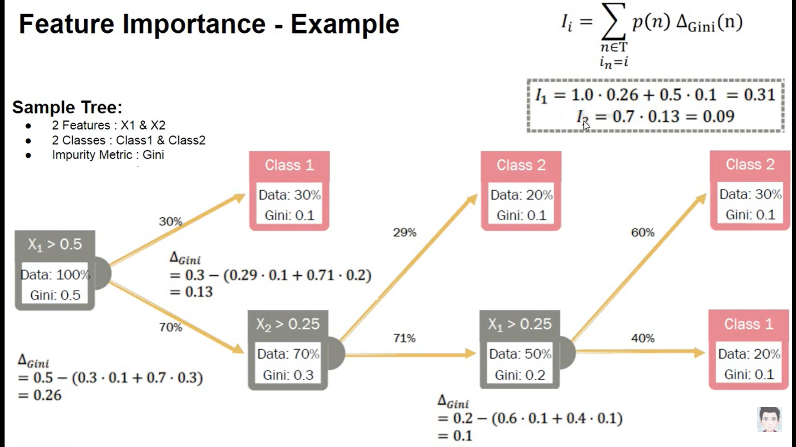
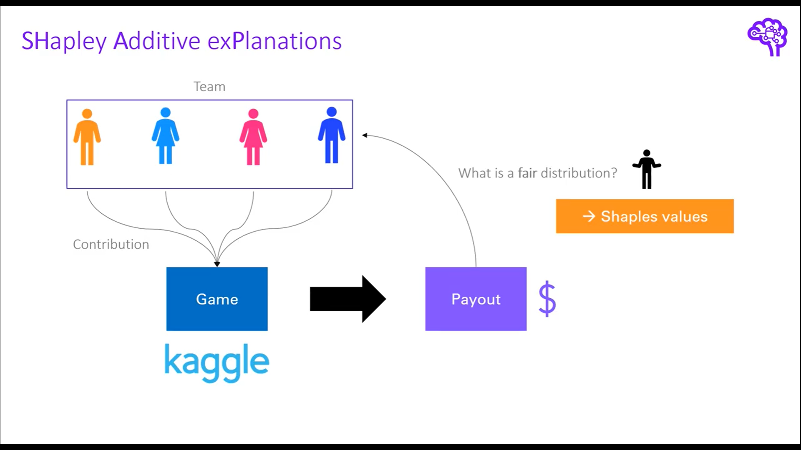
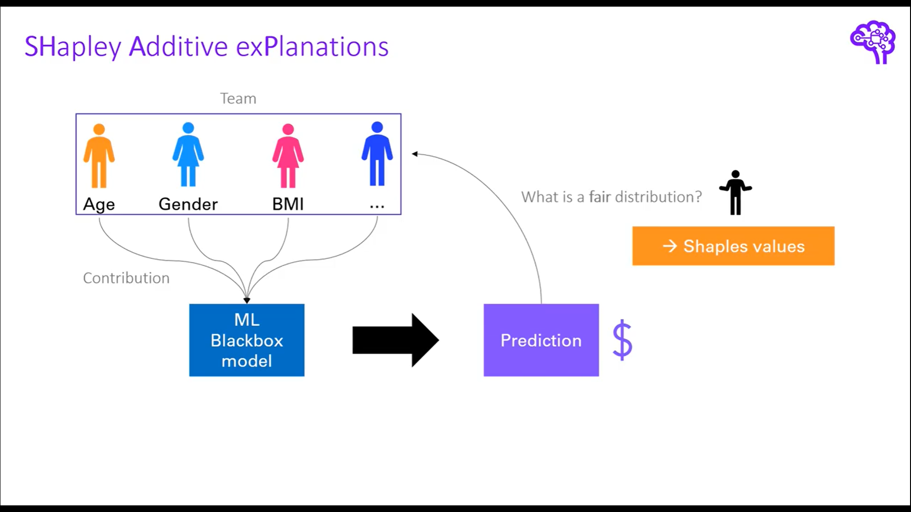

머신러닝 모델을 해석하는 방법은 크게 두 가지 범주로 나뉜다. 특정 모델에 한정된 방법 (Model-specific method)과 모델에 상관없이 사용할 수 있는 방법(Model-agnostic method)이다. 각 방법론별로 대표적인 방법을 kaggle study 발표 자료를 준비하면서 정리해본다.

# Libraries

```{r load_lib, message=FALSE, warning=FALSE, results='hide'}
library(tidymodels)
library(tidyverse)
library(lubridate)
library(skimr)
library(magrittr)
library(data.table)
library(gridExtra)
library(vip)
library(DALEXtra)

theme_set(theme_bw())
```

# Model-specific method

Model-specific method는 random forest 모델만 다룬다.

## Random forest


그림을 통해 random forest의 아이디어를 간단하게 설명하면 각 boostrap set(복원추출된 데이터) 별로 개별 tree를 하나씩 생성해서 나온 예측 결과를 aggregate해서 최종 예측 모델을 만드는 방법이다. 보통 random forest로 예측을 한 후에 **feature importance plot**을 통해 변수 중요도를 파악하게 된다. 변수 중요도가 어떻게 계산되는지 몰랐는데 이번 기회에 정리해본다.

변수 중요도를 계산하는 방법은 크게 gini impurity를 이용한 방법과 permutation을 이용한 방법 2가지가 있다. 먼저 gini impurity를 이용한 방법부터 살펴보자.

## Gini importance in random forest

먼저 single tree에 대해 gini importance가 어떻게 계산되는지 보자.

**Single tree 일 때** $$
\begin{align*}
&VI_i = \sum_{n \in t, i_n = i} p(n) \boldsymbol{\Delta}_{gini}(n), \\
&i_n : \text{Sum over all nodes of the tree that use feature i} \\
&p(n) : \text{Probability of using that node for a sample data point} \\
&\boldsymbol{\Delta}_{gini}(n) : \text{Change in gini impurity at that node}
\end{align*}
$$

각 feature별 gini importance 값은 해당 feature 노드의 gini impurity 값의 변화율을 이용해서 계산된다.

밑에 예시를 통해 $X_1$, $X_2$ 변수의 gini importance가 어떻게 계산되는지 알아보자.



각 노드별로 gini impurity 값이 산출되었다고 했을 때, feature importance를 구하기 위해서는 $\boldsymbol{\Delta_{gini}}$의 값을 구해야한다.

$\boldsymbol{\Delta_{gini}}$를 어떻게 구하는지를 $X_1$ 변수를 기준으로 보면 기준노드의 gini impurity값과 split된 노드의 gini impurity값의 차이를 통해 계산된다. 정확히는 split된 노드에 해당하는 데이터의 비율을 gini impurity에 곱한 가중합과 기준 노드의 gini impurity 값의 차이를 통해 계산된다. $X_1$의 $\boldsymbol{\Delta_{gini}}$는 0.26으로 계산됨을 아래 이미지에서 확인할 수 있다.

이렇게 기준 변수에 해당하는 노드의 $\boldsymbol{\Delta_{gini}}$를 구했으면 마지막으로 $p(n)$ 즉, 해당 노드의 데이터의 비율을 가중합하면 개별 변수의 변수 중요도가 산출된다.

정리하면 tree에서 가지를 뻗어나갈 때 해당 변수의 gini impurity가 얼마나 개선되었는지를 이용해서 변수 중요도를 산출한다고 볼 수 있다.

이제 Random forest일 때로 돌아가보자.

**Random forest일 때**

Random forest일 때는 모델 특성상 각 부스트랩 샘플당 tree가 하나씩 나오게 되는데 각 tree에서 구한 $VI_i$ 값을 평균내주면 된다.

$$
\begin{align*}
VI_i=\frac{1}{|B|} \sum_{t \in B} VI_i(t)
\end{align*}
$$

## Purmutation importance in random forest

위에서 설명한 gini importance는 gini impurity의 변화율을 활용해서 feature importance를 산출하는 방법이다. purmutation importance도 위의 gini importance와 방식은 동일하지만 gini 값이 아닌 다른 지표를 활용한다는 것에서만 차이가 있다.

먼저 알고리즘에 대해 살펴보자(분류 문제일 때)

$$
\begin{align*}
\text{within each tree } t \\
&VI^{(t)}(x_j) = \frac{\sum_{i=\bar B^{(t)}} I(y_i = \hat{y}_i^{(t)})}{|\bar B^{(t)}|} - \frac{\sum_{i=\bar B^{(t)}} I(y_i = \hat{y}_{i, \pi_j}^{(t)})}{|\bar B^{(t)}|}  \\
&\hat{y}_i^{(t)} = f^{(t)}(x_i) : \text{predicted class before permuting} \\
&\hat{y}_{i, \pi_j}^{(t)} = f^{(t)}(x_{i, \pi_j}) : \text{predicted class after permuting }X_j \\
&X_{i, \pi_j} = (x_{i,1}, \cdots, x_{i, j-1}, x_{\pi_j(i), j}, x_{i, j+1}, \cdots , x_{i, p}) \\ 
& \bar B^{(t)} = \text{out of bag sample} \\
\text{over all trees:} \\ 
&\text{1. row importance : } VI(x_j) = \frac{\sum_{t = 1}^{ntree}VI^{(t)}(x_j)}{ntree} \\ 
&\text{2. scale importance : } sVI(x_j) = \frac{VI(x_j)}{\frac{\hat{\sigma}}{\sqrt ntree}} \\ 
\end{align*}
$$ 수식을 보면 개별 tree에 대해서 $t=1$일 때 $\sum_{i = B} I(y_i = \hat{y_i})$와 $\sum_{i = B} I(y_i = \hat{y_i, \pi_j})$ 의 차이를 통해 feature importance 값이 계산되고, 각 부스트랩 샘플에 해당하는 tree당 계산된 feature importance 값을 평균내주면 random forest에서의 feature importance 값이 계산된다. 여기서 purmutation 개념이 나오는데 아이디어는 간단하다. feature importance를 구하고자 하는 target variable만 다른 변수의 값은 고정한 채로 행 단위로 shuffling을 진행한다. 이렇게 무작위로 shuffling 했을 때의 예측값과 shuffling하지 않았을 때의 예측값의 차이를 이용해서 변수 중요도를 산출한다(permutation의 아이디어는 밑에 더 설명한다).

**참고**

<https://www.zeileis.org/papers/Lifestat-2008.pdf>

**R code**

set_engine에 옵션으로 permutation or impurity을 지정해주면 된다.

```{r}
data("ames")
ames_train <- ames %>%
    transmute(Sale_Price = log10(Sale_Price),
              Gr_Liv_Area = as.numeric(Gr_Liv_Area),
              Year_Built, Bldg_Type)

rf_model <- 
    rand_forest(trees = 1000) %>% 
    set_engine("ranger", importance = 'impurity') %>% 
    set_mode("regression")

rf_wflow <- 
    workflow() %>% 
    add_formula(
        Sale_Price ~ Gr_Liv_Area + Year_Built + Bldg_Type) %>% 
    add_model(rf_model) 

rf_fit <- rf_wflow %>% fit(data = ames_train)

rf_fit %>% 
  extract_fit_parsnip()
```

**Gini importance plot**

```{r}
rf_fit %>% 
  extract_fit_parsnip() %>% 
  vip(geom = 'point')

```

# Model-agnostic method

## Permutation importance

permutation importance는 **모델을 학습시킨 이후(post-hoc)** 특정 변수의 관측치를 shuffle했을 때의 예측력을 비교해서 feature importance를 계산하는 방법이다(random forest의 permutation importance도 aggregation이 추가된 것 외에 동일하다).

알고리즘 특성상 특정 모델에 국한된 방법이 아니라 어떤 모델이든 적용할 수 있는 방법이다. permutation importance의 기본 아이디어에 대해 살펴보자.

**Example**


사람의 10살 때의 정보를 이용해서 10년 후 20살 때의 키를 예측하려고 한다.

직관적으로 변수 중 10살 때의 키에 관한 변수는 20살 때의 키를 예측하는데 중요한 변수이고, 10살 때 갖고 있는 양말의 수는 20살 때의 키를 예측하는데 중요한 변수가 아니다.

이러한 직관에서 출발하면 다음과 같은 질문을 해볼 수 있다.

validation set에서 특정 변수의 관측치를 shuffle하고, 나머지 변수를 고정시키면 예측 정확도에 어떤 영향을 미칠까?

특정 한 변수의 관측치만 행방향으로 무작위로 섞기 때문에 당연히 모델의 예측력은 감소하게 될 것이다. 다만 변수별로 정도의 차이가 있을 수 있다. 즉, 위의 예시로 보면 10살 때의 키에 관한 변수를 shuffle 했을 때 모델의 예측력은 많이 떨어지지만, 10살 때 갖고 있는 양말의 수에 관한 변수를 shuffle 했을 때는 모델의 예측력에 큰 차이가 없을 수 있다. 이러한 직관이 purmutaion importance의 아이디어이다.

**Process**

1.  학습이 끝난 모델 세팅
2.  한 변수의 관측치를 shuffling한 데이터를 이용해서 동일하게 예측을 진행
3.  예측치와 실제값의 차이인 손실함수를 이용해서 shuffling 후에 얼마나 loss가 커졌는지 계산
4.  loss의 증감을 이용해서 feature importance를 계산
5.  모든 변수에 대해 반복

**장점**

-   계산 속도가 빠름

    -   특정 변수를 제거하고 재학습을 시키는 것이 아니라 특정 변수 하나를 permutation하는 것이므로 상대적으로 계산량 감소

-   사용 범위가 넓고, 직관적임

-   상대적으로 일관된 feature importance를 측정할 수 있음

**단점**

-   무작위로 shuffling 하다보면 비현실적인 값이 나올 수도 있음

-   weight의 구간을 이용한 해석 필요

**R code**

```{r}
svm_spec <- svm_poly(degree = 1, cost = 1/4) %>%
  set_engine("kernlab") %>%
  set_mode("regression")

svm_wflow <- 
    workflow() %>% 
    add_formula(
        Sale_Price ~ Gr_Liv_Area + Year_Built + Bldg_Type) %>% 
    add_model(svm_spec)

svm_fit <- svm_wflow %>% fit(data = ames_train)

svm_fit %>% 
  extract_fit_parsnip()
```

**permutation importance plot**

tidymodels는 vip 패키지와 연동해서 feature importance plot을 그릴 수 있다. method = "permute"를 지정해주는 것이 중요하다.

```{r}
svm_fit %>%
  extract_fit_parsnip() %>%
  vip(method = "permute", 
      target = "Sale_Price", metric = "rsquared",
      pred_wrapper = kernlab::predict, train = ames_train)
```

permutation을 여러번 반복해서 평균을 낼 수도 있다.

```{r}
svm_fit %>%
  extract_fit_parsnip() %>%
  vip(method = "permute", 
      target = "Sale_Price", metric = "rsquared", nsim = 20, all_permutations = TRUE, 
      geom = "boxplot",
      mapping = aes_string(fill = "Variable"),
      pred_wrapper = kernlab::predict, train = ames_train)
```

**참고** <https://koalaverse.github.io/vip/articles/vip.html>

## Partial dependence plot

feature importance는 어떤 변수가 예측에 큰 영향을 미쳤는지를 보여준다. 반면에 partial dependence plot은 변수가 target variable에 어떤 영향을 미쳤는지를 보여준다.

partial dependence plot은 pumutation importance와 마찬가지로 **모델을 학습한 후(post-hoc)** 계산된다.

먼저 예제를 살펴보자.

**Example**

-   모든 주택에 관한 변수를 통제할 때, 위·경도는 주택가격에 어떤 영향을 미치는가?

-   두 그룹의 건강에 대한 예측 결과의 차이는 식단 때문인가? 아니면 다른 요인 때문인가?

이런 질문에 간접적인 답을 할 수 있는 방법이 partial dependence plot이다. 즉 개별 변수별로 그래프를 그려서 target variable에 어떤 영향을 미쳤는지 설명할 수 있다.

**Process**

$$
\begin{align*}
\hat{f}_{x_s}(x_s) = E_{x_c}[\hat{f}(x_s, x_c)] &= \int \hat{f}(x_s, x_c)dP(x_c) \\
&\approx \frac{1}{n} \sum_{i=1}^n \hat{f}(x_s, x_c^{(i)})\quad  \text{using Monte Carlo}\\
&\hat{f} : \text{학습이 완료된 임의의 모델} \\ 
& x_s : \text{plot하고자 하는 변수} \\
& x_c : x_s\text{ 외 나머지 변수}
\end{align*}
$$

$\hat{f}$를 안다고 할 때, $x_{c}^{(i)}$ 는 데이터셋으로 부터 주어진 값이므로 $x_s$에 값을 넣어서 값을 얻을 수 있다. $\hat{f}$는 학습이 완료된 모델이지만 적분이 불가능하므로 monte carlo integration을 이용해서 근사적으로 계산한다.

**즉, 관심변수 외에 다른 변수들의 값이 고정되어 있을 때 관심 변수 값에 따라 모델의 예측값이 어떻게 변화하는지를 보는 것이다.**

partial dependence plot은 회귀분석에서 회귀계수를 해석하는 방식과 동일하며, 관심 변수와 관심변수 외의 변수들 간의 **독립**을 가정하는 것 또한 동일하다.

**장점**

-   해석이 직관적임

-   상대적으로 구현하기 쉬움

**단점**

-   2차원으로 표현되기 때문에 변수 2개에 대해서만 해석 가능

-   계산량이 많음

-   독립성 가정

**R code**

```{r}
data(ames)
ames_train <- ames %>%
    transmute(Sale_Price = log10(Sale_Price),
              Gr_Liv_Area = as.numeric(Gr_Liv_Area), 
              Year_Built, Bldg_Type)

rf_model <- 
    rand_forest(trees = 1000) %>% 
    set_engine("ranger") %>% 
    set_mode("regression")

rf_wflow <- 
    workflow() %>% 
    add_formula(
        Sale_Price ~ Gr_Liv_Area + Year_Built + Bldg_Type) %>% 
    add_model(rf_model) 

rf_fit <- rf_wflow %>% fit(data = ames_train)

```

**Partial Dependence Plot** DALEXtra 패키지를 이용해서 partial dependence plot을 그릴 수 있다. model_profile 함수 안에 variable = ""에 그리고 싶은 변수를 지정하면 된다. group별 plot을 보고 싶으면 group 옵션을 선택할 수 있다.

```{r}
library(DALEXtra)

explainer_rf <- explain_tidymodels(
    rf_fit, 
    data = dplyr::select(ames_train, -Sale_Price), 
    y = ames_train$Sale_Price,
    label = "random forest"
)

pdp_rf <- model_profile(explainer_rf, N = NULL, 
                        variables = "Gr_Liv_Area", groups = "Bldg_Type")

plot(pdp_rf)

```

## Shapley value

Shapley value는 Lloyd Shapley가 정의한 협동적 게임이론을 근거로 한 방법론이다. 협동적 게임이론은 몰라도 되는 것 같다...



그림을 통해 보면 4명이 팀을 이뤄서 kaggle competition에 우승을 했다고 해보자. 우승 상금을 분배해야하는데 어떻게 하면 공정하게 분배할 수 있을까?

가장 공평한 방법은 개별 팀원의 기여도를 통해서 우승에 크게 기여한 사람에게 큰 금액을, 우승에 작게 기여한 사람에게 적은 금액을 부여하는 것이다. 여기서 한 가지 문제는 기여도를 어떻게 측정할 것인지에 대한 측도가 필요하다. 가장 쉬운 방법은 한명이 빠졌을 때의 상금과 4명이 우승했을 때의 상금을 비교하는 것이다.

그림으로 예를 들면 파란색 팀원은 도메인 전문가로 팀에 상당한 기여를 했다고 가정해보자. 파란색 팀원이 빠졌을 경우 팀은 3등으로 순위가 떨어져 상금을 3000 달러 밖에 수령하지 못한다고 가정해보면 파란색 팀원은 대략 7000달러의 기여도를 갖고 있다고 볼 수 있다.

이렇게 개별 팀원이 빠졌을 때와 빠지지 않았을 때를 비교해서 쉽게 기여도를 계산할 수 있지만, 문제점은 개별 팀원 사이에 관계를 고려하지 못하는 것이다.

shapley value는 이러한 문제를 극복하기 위해서 개별 팀원이 빠졌을 때와 빠지지 않았을 때의 모든 경우의 수를 고려해서 개별 팀원의 기여도를 계산하는 방식을 채택한다.



머신러닝 모델로 일반화를 하면 팀 내의 개별 팀원은 feature로 볼 수 있고, Game은 Black box 모델, Payout은 prediction 값으로 볼 수 있다. 정리하면 shapley value는 각 feature가 예측에 얼마나 기여를 했는지 측정하는 측도로 볼 수 있고, 이 측도를 구하기 위해서 모든 하위 부분집합의 값을 계산하는 방법을 채택한다. 이를 **marginal contribution** 이라고 하며, 각 feature 별로 계산된 **marginal contribution**을 평균내서 최종 shapley value 값을 산출한다.

**process**

$$
\begin{align*}
\phi_j(val) &= \sum_{S \subseteq\{x_1, \cdots, x_p\}\setminus \{x_j\}} \frac{|S|!(P-|S|-1)!}{p!}(val(S \cup\{x_j\})-val(S)) \\
&S : \text{subset of the features} \\
&p : \text{the number of features} \\
&x : \text{the vector of feature values of instance to be explained} \\
&val : \text{prediction for feature values}
\end{align*}
$$

shapley value를 구하는 순서는 간략하게 다음과 같다.

1.  기준변수를 제외했을 때와 제외하지 않았을 때 예측값의 차이를 계산
2.  가중치 계산
3.  가중합 계산

**Example**

위의 kaggle competition 예제로 다시 돌아가서 kaggle competition에 참여한 3명의 player가 있다고 가정해보자. 여기서 각 player에 대한 상금의 기여분에 대한 경우의 수는 다음과 같다.

$$
\begin{align*}
&val(1) = 100, \, val(2) = 125, \, val(3) = 50, \\
&val(1, 2) = 270, \, val(1, 3) = 375, \, val(2, 3) = 350, \\
&\, val(1, 2, 3) = 500
\end{align*}
$$

즉, 3명의 player가 모두 참여했을 때는 500\$를 수령할 수 있지만, 1번 player만 참여했을 때는 100\$, 2번 player만 참여했을 때는 125\$, 1번과 2번 player가 동시에 참여했을 때는 270\$ .. etc 으로 해석할 수 있다(실제 ML model에서 val은 prediction value이므로 주어진 값이다).

이제 각 player별 **marginal contribution**을 계산할 수 있는데 아래 table과 같이 계산된다.

+--------------+------------------------+-------------------------------------------+----------------------------------------------------------------------------------+----------------------------------------------------------------------------------------------------------------+
| Probability  | combination            | 1's marginal contribution                 | 2's marginal contribution                                                        | 3's marginal contribution                                                                                      |
+==============+========================+===========================================+==================================================================================+================================================================================================================+
| $$           | first 1, then2, then3: | $$                                        | $$                                                                               | $$                                                                                                             |
|  \frac{1}{6} |                        |                              val(1) = 100 |                                                          val(1,2)-val(1) = 170   |                                                                                      val(1,2,3)-val(1,2) = 230 |
|  $$          | $$                     |                              $$           |                                                          $$                      |                                                                                      $$                        |
|              |                123     |                                           |                                                                                  |                                                                                                                |
|              |                $$      |                                           |                                                                                  |                                                                                                                |
+--------------+------------------------+-------------------------------------------+----------------------------------------------------------------------------------+----------------------------------------------------------------------------------------------------------------+
| $$           | $$                     | $$                                        | $$                                                                               | $$                                                                                                             |
|  \frac{1}{6} |                132     |                              val(1)=100   |                                                          val(1,2,3)=val(1,3)=125 |                                                                                      val(1,3)-val(1)=275       |
|  $$          |                $$      |                              $$           |                                                          $$                      |                                                                                      $$                        |
+--------------+------------------------+-------------------------------------------+----------------------------------------------------------------------------------+----------------------------------------------------------------------------------------------------------------+
| $$           | $$                     | $$                                        | $$                                                                               | $$                                                                                                             |
|  \frac{1}{6} |                213     | val(1,2)-val(2)=145                       | val(2)=125                                                                       | val(1,2,3)-val(1,2)=230                                                                                        |
|  $$          |                $$      | $$                                        | $$                                                                               | $$                                                                                                             |
+--------------+------------------------+-------------------------------------------+----------------------------------------------------------------------------------+----------------------------------------------------------------------------------------------------------------+
| $$           | $$                     | $$                                        | $$                                                                               | $$                                                                                                             |
|  \frac{1}{6} |                231     | val(1,2,3)-val(2,3)=150                   | val(2)=125                                                                       | val(2,3)-val(2)=225                                                                                            |
|  $$          |                $$      | $$                                        | $$                                                                               | $$                                                                                                             |
+--------------+------------------------+-------------------------------------------+----------------------------------------------------------------------------------+----------------------------------------------------------------------------------------------------------------+
| $$           | $$                     | $$                                        | $$                                                                               | $$                                                                                                             |
|  \frac{1}{6} |                312     | val(1,3)-val(3)=375                       | val(1,2,3)-val(1,3)=125                                                          | val(3)=50                                                                                                      |
|  $$          |                $$      | $$                                        | $$                                                                               | $$                                                                                                             |
+--------------+------------------------+-------------------------------------------+----------------------------------------------------------------------------------+----------------------------------------------------------------------------------------------------------------+
| $$           | $$                     | $$                                        | $$                                                                               | $$                                                                                                             |
|  \frac{1}{6} |                321     | val(1,2,3)-val(2,3)=150                   | val(2,3)-val(3)=300                                                              | val(3)=50                                                                                                      |
|  $$          |                $$      | $$                                        | $$                                                                               | $$                                                                                                             |
+--------------+------------------------+-------------------------------------------+----------------------------------------------------------------------------------+----------------------------------------------------------------------------------------------------------------+

: <http://faculty.econ.ucdavis.edu/faculty/bonanno/teaching/122/Shapley.pdf>

각 변수별 expected marginal contribution, 즉 shapley value를 구해보면 다음과 같다.

$\phi_1(val)$(1's expected marginal contribution) : $\frac{1}{6}(100+100+145+150+325+150)=\frac{970}{6}$

$\phi_2(val)$(2's expected marginal contribution) : $\frac{1}{6}(170+125+125+125+125+300)=\frac{970}{6}$

$\phi_3(val)$(3's expected marginal contribution) : $\frac{1}{6}(230+275+230+225+50+50)=\frac{1060}{6}$

1's, 2's, 3's expected marginal contribution을 모두 합하면 500이 되고, 이 값은 $val(1,2,3)$ 값과 같다.

$\frac{970+970+1060}{6}=\frac{3000}{6} = 500=val(1,2,3)$

**R code**

**package: fastshap, DALEX, iml, shapper등이 있음**

## DALEX 패키지를 이용해서 SHAP을 그리는 방법

-   tidymodels workflow를 동일하게 수행

-   fit함수의 결과를 변수에 저장

```{r}
library(DALEX)
titanic %>% is.na() %>% colSums()
titanic_rec <- titanic %>% 
  recipe(survived ~ class + gender + age + 
                sibsp + parch + fare + embarked) %>% 
  step_bagimpute(age, fare, sibsp, parch)
  
rf_model <- 
    rand_forest(trees = 1000) %>% 
    set_engine("ranger") %>% 
    set_mode("classification")

rf_wflow <- 
  workflow() %>% 
  add_model(rf_model) %>% 
  add_recipe(titanic_rec)
  

rf_fit <- rf_wflow %>% fit(data = titanic %>% select(-country))
rf_ex_fit <- rf_fit %>% extract_fit_parsnip()
```

-   explain()

    -   model : fitting 완료된 모델

    -   data : target 변수 제외한 데이터프레임

    -   y : target 변수

-   다른 라이브러리를 이용해서 모델을 fitting 했을 때 구조가 서로 다를 수 있으므로 explain 함수를 이용해서 균일한 인터페이스를 갖는 객체로 만들어줌

-   shapley value가 계산되는 것은 아님

```{r}
library(DALEX)
titanic_rf_exp <-DALEX::explain(model = rf_fit, 
                       data = titanic %>% select(-country),
                       y = titanic_imputed$survived == "yes", 
                       label = "Random Forest")


henry <- archivist::aread("pbiecek/models/a6538") 
henry

predict(titanic_rf_exp, henry)
```

**shapley value 계산**

-   predict_parts()

    -   explainer : explain 함수를 적용한 모델

    -   new_observation : obs

    -   type : shap, oscillations, oscillations_uni, oscillations_emp, break_down or break_down_interactions 등의 다양한 옵션이 있음

    -   B : 25(default), shapley value 계산할 때 설명변수의 무작위 순서의 조합 개수

```{r}
shap_henry <- predict_parts(explainer = titanic_rf_exp,
                      new_observation = henry, 
                                 type = "shap",
                                    B = 25)
shap_henry
```

```{r}
plot(shap_henry)
```

-   henry의 나이는 47세로 shapley value 값이 음수로 표시되고, age는 생존에 부정적인 기여를 했다고 해석할 수 있음

-   henry의 class는 1등석으로 shapley value 값이 양수로 표시되고, class는 생존에 매우 긍정적인 기여를 했다고 해석할 수 있음

## fastshap 패키지를 이용한 방법

-   fastshap::explain()

    -   model : extract_fit_parsnip() 적용한 모델

    -   X : data

    -   pred_wrapper : 예측값, classification의 경우 기준 범주의 확률

        -   xgb, lm은 적용안하고 exact = T만 해줘도 됨

        -   나머지 모델은 pred_wrapper을 넣어줘야함

    -   exact = T : 근사값이 아닌 정확한 shapley value 계산
    

**Shapley feature importance**

```{r}
data("titanic_imputed")  

titanic_rec <- titanic_imputed %>% 
  recipe(survived ~ .) %>% 
  step_mutate(survived = as.factor(survived))
  
rf_model <- 
    rand_forest(trees = 1000) %>% 
    set_engine("ranger") %>% 
    set_mode("classification")

rf_wflow <- 
  workflow() %>% 
  add_model(rf_model) %>% 
  add_recipe(titanic_rec)
  

rf_fit <- rf_wflow %>% fit(data = titanic_imputed)
rf_ex_fit <- rf_fit %>% extract_fit_parsnip()

```


-   shap <- explain(xgb_ex_fit$fit, X = X, exact = T)
-   xgboost, lm만 exact = T 가능, 나머지 불가능(공식 문서 참고)


```{r}
library(fastshap)
predict(rf_ex_fit$fit, titanic_imputed)
predict(rf_ex_fit$fit, titanic_imputed)$predictions %>% head()

pred_fun <- function(X.model, newdata) {
  predict(X.model, newdata)$predictions[,2]
}

shap <- explain(rf_ex_fit$fit, X = titanic_imputed, pred_wrapper = pred_fun, nsim = 20)

autoplot(shap)


```

**Shapley dependence plot**

```{r}
pred_fun <- function(X.model, newdata) {
  predict(X.model, newdata)$predictions[,2]
}

autoplot(shap, type = "dependence", feature = "fare", X = titanic_imputed, smooth = TRUE)


```

**contribution plot**

```{r}
autoplot(shap, type = "contribution", row_num = 1)
```


```{r, error = T}
force_plot(shap[1,], baseline = mean(pred_fun(rf_ex_fit, titanic_imputed)), feature_values = titanic_imputed[1,], display = "html")

```


<http://xai-tools.drwhy.ai/fastshap.html>

**참고자료**

<https://www.kaggle.com/dansbecker/use-cases-for-model-insights>

<https://www.kaggle.com/dansbecker/permutation-importance>

<https://www.kaggle.com/dansbecker/partial-plots?scriptVersionId=64768853&cellId=1>

<https://christophm.github.io/interpretable-ml-book/pdp.html>

<https://juliasilge.com/blog/mario-kart/>

<https://www.hfshr.xyz/posts/2020-06-07-variable-importance-with-fastshap/#ref-R-vip>

<https://stackoverflow.com/questions/67634344/r-partial-dependence-plots-from-workflow>

<https://cran.r-project.org/web/packages/fastshap/fastshap.pdf>

<https://www.youtube.com/watch?v=lIT5-piVtRw>

<https://www.hfshr.xyz/posts/2020-06-07-variable-importance-with-fastshap/>

<https://bradleyboehmke.github.io/HOML/iml.html>

<https://ema.drwhy.ai/shapley.html#SHAPRcode>
