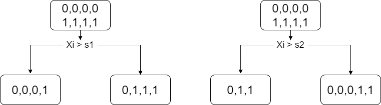

```{r setup, include=FALSE}
options(htmltools.dir.version = FALSE)
```

```{r xaringan-themer, include=FALSE, warning=FALSE}
library(tidyverse)
library(reticulate)
library(xaringanthemer)
library(magrittr)
theme_set(theme_bw())
style_duo_accent(
  text_font_size = "1.3rem",
  footnote_font_size = "0.6em",
  footnote_position_bottom = "20px",
  primary_color = "#7dad47",
  secondary_color = "#01467f",
  inverse_header_color = "#FFFFFF",
  code_font_google   = google_font("Fira Mono")
)
```

# Introduction to CART

* One of the oldest and simplest ML algorithms.

* Idea: split the feature space into **exhaustive and mutually exclusive** segments under some rules.

---
# Advantage vs. Disadvantage

.pull-left[

Advantage

* Easy to explain to people.

* People believe that DT mirror human decision making than regression.

* Easy to handle categorical data without doing dummy coding.

* Insensitive to monotone transformation of inputs

* Robust to outliers

]
.pull-right[

Disadvantage

* Level of predictive accuracy is lower than other models

* Trees can be very non-robust. Small changes in the data can cause a large change in the final output.


by `ISLR`

]


---
# Simple tree solution

.pull-left[

Can we divide these points into two groups by lines?

]
.pull-right[
```{r echo=FALSE}
plotdata <- tibble(x = runif(100), 
                   y = runif(100) * 2, 
                   mark = ifelse(x > 0.5 & y < 0.5, 1, 0)) 
plotdata %>% 
  ggplot(aes(x = x , y = y, 
             color = as_factor(mark))) +
  geom_point(size = 3) + theme_bw() +
  labs(color = "group")
```

]

---
# Simple tree solution

.pull-left[

Can we divide these points into two groups by lines? `Yes`

The following two lines

* $x = 0.5$
* $y = 0.5$

]
.pull-right[
```{r echo=FALSE}
plotdata <- tibble(x = runif(100), 
                   y = runif(100) * 2, 
                   mark = ifelse(x > 0.5 & y < 0.5, 1, 0)) 
plotdata %>% 
  ggplot(aes(x = x , y = y, 
             color = as_factor(mark))) +
  geom_point(size = 3) + theme_bw() +
  labs(color = "group") +
  geom_hline(yintercept = 0.5) +
  geom_vline(xintercept = 0.5)
```

]

---
# Simple tree regression

.pull-left[

Can we predict this function by calculating mean of some sections?

]
.pull-right[
```{r echo=FALSE}
plotdata <- tibble(x = -10:10, y = (-10:10)^2)
plotdata %>% 
  ggplot(aes(x = x , y = y)) +
  geom_line(size = 3) + theme_bw()
```

]

---
# Simple tree regression

.pull-left[

Can we predict this function by calculating mean of some sections? 

How about these four sections?

* $R_1: \{x| 0< x <   25\}$
* $R_2: \{x| 25 < x < 50\}$
* $R_3: \{x| 50 < x < 75\}$
* $R_4: \{x| 75 < x < 100\}$

]
.pull-right[

```{r echo=FALSE, message=FALSE, warning=FALSE}
plotdata <- tibble(x = -10:10, y = x^2)
plotdata %<>%
  mutate(xcut = cut(x, breaks = seq(-10, 10, by = 2.5) ))
plotdata %>% 
  group_by(xcut) %>% 
  summarise(mean_y = mean(y)) %>% 
  drop_na() -> mean_y

predict_data <- tibble(x = seq(-10, 10, 0.1), y = x^2) %>% 
  mutate(xcut = cut(x, breaks = seq(-10, 10, by = 2.5) )) %>% 
  left_join(mean_y)

plotdata %>% 
  left_join(mean_y) %>% 
  ggplot() +
  geom_line(aes(x = x, y = y)) +
  geom_line(data = predict_data, 
            aes(x = x, y = mean_y,
                group = xcut), col = "blue") +
  theme_bw()
```

]

---
# Prediction via stratification of the feature space

* Divide the predictior spaces into $J$ distinct and non-overlapping regions, $R_1, ..., R_J$ 

* Goal: find $R_1, ..., R_J$ that minimize the RSS

$$\sum_{j=1}^{J}\sum_{i\in R_{j}}\left(y_{i}-\hat{y}_{R_{j}}\right)^{2}$$
---
# Let's be `greedy`!

There are infinite number of splitting partitions.

* top-down, greedy approach; a.k.a. recursive binary splitting.

* For the predictor $X_j$, define

  * $R_1(j, s) = \{X|X_j \leq s\}$ and $R_2(j, s) = \{X|X_j > s\}$

* For $j$ and $s$, find the value of $j$ and $s$

$$\sum_{i:x_{i}\in R_{1}\left(j,s\right)}\left(y_{i}-\hat{y}_{R_{1}}\right)^{2}+\sum_{i:x_{i}\in R_{2}\left(j,s\right)}\left(y_{i}-\hat{y}_{R_{2}}\right)^{2}$$


---
class: middle, center

# Overfitting Problem

```{r overfit, echo=FALSE, fig.cap="", fig.align='center', out.width = '30%'}

```


---
# When there is noise..


.pull-left[

We have our data model

$$y_i = x_i^2 + e_i$$

where $e_i \sim \mathcal{N}(0, 10^2)$


Do we want this?

* No. These lines are too much fitted to the points.

* This model is `overfitted` to the data.

]
.pull-right[

```{r echo=FALSE, message=FALSE, warning=FALSE}
plotdata <- tibble(x = seq(-10, 10, by = 0.1), y = x^2 + rnorm(length(x), sd = 10))
plotdata %<>%
  mutate(xcut = cut(x, breaks = seq(-10, 10, by = 0.2) ))
plotdata %>% 
  group_by(xcut) %>% 
  summarise(mean_y = mean(y)) %>% 
  drop_na() -> mean_y

predict_data <- plotdata %>% 
  mutate(xcut = cut(x, breaks = seq(-10, 10, by = 0.2) )) %>% 
  left_join(mean_y)

plotdata %>% 
  left_join(mean_y) %>% 
  ggplot() +
  geom_point(aes(x = x, y = y)) +
  geom_path(data = predict_data, 
            aes(x = x, y = mean_y), col = "blue", size = 1.5) +
  theme_bw()
```

]

---
# We need something like this.

.pull-left[

It captures the general data trend. 

* Simpler than before.

* It can also be used for the `future data`.


]
.pull-right[

```{r echo=FALSE, message=FALSE, warning=FALSE}
plotdata <- tibble(x = seq(-10, 10, by = 0.1), y = x^2 + rnorm(length(x), sd = 10))
plotdata %<>%
  mutate(xcut = cut(x, breaks = seq(-10, 10, by = 2) ))
plotdata %>% 
  group_by(xcut) %>% 
  summarise(mean_y = mean(y)) %>% 
  drop_na() -> mean_y

predict_data <- plotdata %>% 
  mutate(xcut = cut(x, breaks = seq(-10, 10, by = 2) )) %>% 
  left_join(mean_y)

plotdata %>% 
  left_join(mean_y) %>% 
  ggplot() +
  geom_point(aes(x = x, y = y)) +
  geom_path(data = predict_data, 
            aes(x = x, y = mean_y), col = "red", size = 1.5) +
  theme_bw()
```

]

---
class: middle, center

# How to avoid overfitting?

## `Prunning`

```{r cut, echo=FALSE, fig.cap="", fig.align='center', out.width = '15%'}

```


.footnote[
<div>Icons made by <a href="https://www.freepik.com" title="Freepik">Freepik</a> from <a href="https://www.flaticon.com/" title="Flaticon">www.flaticon.com</a></div>
]

---
# Build a tree with threshold

1. Build tree until the decrease in the RSS due to each split exceeds some threshold

  * will result smaller trees

  * short sighted trees..

2. Grow a very large tree $T$ first and cut (`prune`) the branches to make a subtree $T_0$

  * how to `prune` tho?

---
# Cost complexity pruning

For each value of $\alpha$, a tunning parameter, there is a subtree which minimizes
  
$$\sum_{m=1}^{\left|T\right|}\sum_{i:x_{i}\in R_{m}}\left(y_{i}-\hat{y}_{R_{m}}\right)^{2}+\alpha\left|T\right|$$  

as small as possible. 

* $|T|$: number of the terminal nodes of the tree $T$

* $R_m$: rectangle corresponding to the $m$th terminal node

* $\hat{y}_{R_m}$ predicted response associated with $R_m$

* $alpha$ can be found using CV.

---
# Classification Trees

Classification tree predict a qualitative response.

* predict the most commonly occurring class

* Given region, 

  * Male : 50
  
  * Female : 100
  
  * Predict the label for the given region as `Female`

---
# How to build?

* We don't have the concept of $RSS$

* Natural alternative to $RSS$ is the `classification error rate`

$$\frac{\text{# of sample} \notin \text{the class label}}{\text{# of toal samples in the given } R}$$
more mathematically,

$$E=1-\underset{k}{max}(\hat{p}_{mk})$$

But, this is not sufficiently sensitive for tree-growing.

---
# Gini impurity

Measure of `total variance` across the $K$ classes.

.pull-left[

$$\begin{align*}
G & =\sum_{k=1}^{K}\hat{p}_{k}\left(1-\hat{p}_{k}\right)\\
 & =1-\sum_{k=1}^{K}p_{k}^{2}
\end{align*}$$

* Plot shows the Gini w.r.t. `p` when $K=2$.

* We can easily see that G takes on a small value if all $p_k$ are close to 0 or 1.

]
.pull-right[

```{r echo=FALSE, warning=FALSE, out.width="80%"}
gini <- function(p){p*(1-p) + (1-p)*p}
tibble(x = seq(0, 1, by = 0.01), y = gini(x)) %>% 
  ggplot(aes(x = x, y = y)) +
  labs(x = "p", y = "impurity") +
  geom_line()
```

]

---
# Example

* Gini impurity for these?

$$G	=1-\sum_{k=1}^{K}p_{k}^{2}$$

  * 1, 1, 1, 0, 0, 0
  
  * 1, 1, 1, 1, 1, 1
  
  * 1, 1, 1, 1, 0, 0

---
# Gini index

Given $R(j, s)$, the Gini index is the weighted sum of gini impurity of the resulting subsets; Which one is better split?

```{r giniindex, echo=FALSE, fig.cap="", fig.align='center', out.width = '100%'}

```

---
# Entropy

Measure of `impurity` of each node in a DT.

.pull-left[

$$E=-\sum_{k=1}^{K}\hat{p}_{k}log\hat{p}_{k}$$

* Plot shows the entropy w.r.t. `p` when $K=2$.

]
.pull-right[

```{r echo=FALSE, warning=FALSE, out.width="80%"}
entropy <- function(p){-p*log(p) - (1-p)*log(1-p)}
tibble(x = seq(0, 1, by = 0.01), y = entropy(x)) %>% 
  ggplot(aes(x = x, y = y)) +
  labs(x = "p", y = "impurity") +
  geom_line()
```

]

---
# Example

* Entropy for these?

$$E=-\sum_{k=1}^{K}\hat{p}_{k}log\hat{p}_{k}$$
  * 1, 1, 1, 0, 0, 0
  
  * 1, 1, 1, 1, 1, 1
  
  * 1, 1, 1, 1, 0, 0


---
# Information Gain

Given $R(j, s)$, the information gain:

Entropy for parent node - the weighted average of entropy of the resulting subsets; Which one is better split?

```{r infogain, echo=FALSE, fig.cap="", fig.align='center', out.width = '100%'}

```

---
# Build a tree in classification

Find $R(j, s)$ which 

* `Minimizes` Gini Index or

* `Maximizes` Information Gain 

Repeat this process until

* `max depth` reaches or leaf has `100% purity`.


---

```{r eval=FALSE}
library(tree)
library(ISLR)
library(magrittr)
library(rpart)
library(rpart.plot)

high <- ifelse(Sales <=8, "NO", "YES")
my_data <- data.frame(Carseats, high)
result <- tree(high~.-Sales, my_data)
summary(result)
mydata <- Carseats %>% janitor::clean_names() 

mydata %<>% 
  mutate(high = ifelse(sales <= 8, "No", "Yes")) %>% 
  select(-sales)
tree_carseats <- tree(high ~ ., data = mydata)

summary(tree_carseats)
```


---
class: middle, center, inverse

# Thanks!


