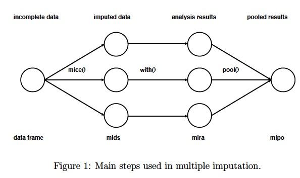

```{r setup, include=FALSE}
knitr::opts_chunk$set(warning = FALSE, message = FALSE, 
                      fig.retina = 3, fig.align = "center")
```

```{r packages-data, include=FALSE}
library(tidyverse)
library(kableExtra)
```

```{r xaringanExtra, echo=FALSE}
xaringanExtra::use_xaringan_extra(c("tile_view"))
```
class: center middle main-title section-title-4

# Imputations for Walmart Data

.class-info[

**Sanghoon Park**

.light[
March 19th Kaggle Study Presentation

]

.light[
github.com/statisticsplaybook/kaggle-study
]

]

---

class: middle

.box-4.huge[Missing data]

.box-inv-4[Values that are not available <br> that would be meaningful if not observed.]

---

layout: true
class: title title-4

---

# Type of Missing Data

--

.center.float-left[.box-inv-4[Missing Completely at Random (MCAR)]]

--

.center.float-left[.box-inv-4[Missing at Random (MAR)]]

--

.center.float-left[.box-inv-4[Missing Not at Random (MNAR)]]

--

.box-inv-4[**Expectation**]

--

.box-5.sp-after[Missing Data를 "적절하게" 채워넣으면, <br> 더 좋은 추정치를 얻을 수 있을 것.]

--

.box-inv-4.medium[**But How?**]

---

# Missing Completely at Random (MCAR)

.box-inv-4.medium[Missing **not related to** X or Y]

--

.box-inv-4.small[Missingness unrelated to values of variables,<br>
either missing or observed]

.box-inv-4.small[If completely random, results unbiased]

.box-4[However, missing data rarely MCAR]

---

# Missing Completely at Random (MCAR)

.box-inv-4.medium[Missing **not related to** Y, <br> but **may be related to** X]

--

.box-inv-4.small[Missingness unrelated to values of variables,<br>
either missing or observed]

.box-inv-4.small[Cause of missing data unrelated to missing values]

.box-4[But may be related to observed values of other variables]

---

# Missing Not at Random (MNAR)

.box-inv-4.medium[Missing **related to** Y]

--

.box-inv-4.small[Relationship between missingness and values]

.box-inv-4.small[Also, missingness due to unobserved predictors]

.box-4[if non-random, must be modeled or <br> else risks bias
(**non-ignorable**)]

---

# Approaches

.pull-left[
.box-4[Single-imputation methods]

.box-inv-4.small[Substitution]

.box-inv-4.small[Carrying-forward]

.box-inv-4.small[Interpolation]

]

.pull-right[

.box-4[Multiple-imputation methods]

<figure>
  
</figure>

]

---

# Single Imputation Methods
.box-4[Goal:]

.box-inv-4.small[Produce complete dataset by filling in missing values]

--

.pull-left[

.box-4[Substitution]

.box-inv-4.small[e.g. mean, median, mode substitution]

.box-inv-4.small[But mean substitute based on assumption of normal distribution]

]

--

.pull-right[

.box-4[Linear interpolation]

.box-inv-4.small[Use function to extrapolate missings]

.box-inv-4.small[Follows expected trends]
]

---

# Model Based Methods

--

.center.float-left[.box-inv-4[Regression] .box-inv-4[Multiple imputation] .box-inv-4[k-nearest neighbors]]

--

.pull-left[

.box-4[Regression]

.box-inv-4.small[Uses results from regression to fill in missing values]

.box-4[K-Nearest Neighbors]

.box-inv-4.small[Mean of the $k$ values coming from the $k$ most similar
complete observations]
]

--

.pull-right[

.box-4[Multiple imputation]

.box-inv-4.small[Uses the distribution of the observed data to estimate
plausible values]


.box-inv-4.small[Random components incorporated to reflect uncertainty]

.box-inv-4.small[Individually analyze multiple datasets &rarr; Estimates combined]

]

---

# Score Comparisons

.box-inv-4.small[`Park-benchmark-comparison-mar-19.R`]

Building benchmark model:

```{r, eval = F}
# Load packages
library(tidyverse)
library(tidymodels)
library(magrittr)
library(knitr)
```

---

# Score Comparisons

Import dataset as `train` and `test`

```{r, eval = F}
train <- read_csv(
  here("data/walmart/train.csv.zip"))
test <- read_csv(
  here("data/walmart/test.csv.zip"))
```

Combine two datasets

```{r, eval = F}
all_data <- bind_rows(train, test) %>%
    janitor::clean_names()
```

---

# Benchmark model: lm with store

전처리를 위한 `recipe` 설정과 $X$ 추출

```{r, eval = F}
bench_recipe <- all_data %>% 
    recipe(weekly_sales ~ store) %>% 
    step_mutate(
        store = as.factor(store)) %>%
    prep()
# Produce X manipulated by recipe
benchmark <- juice(bench_recipe) 
```

---

# Fitting the model

.pull-left[
`Train`과 `Test` 분리

```{r, eval = F}
index <- 
  seq_len(nrow(train))
train_bench <- 
  benchmark[index,]
test_bench <- 
  benchmark[-index,]
```
]

.pull-right[
`lm` 엔진을 이용하여 fit.

```{r, eval = F}
lm_benchmark_fit <- 
    linear_reg() %>% 
  set_engine("lm") %>%
    fit(weekly_sales ~ store, 
        data = train_bench)
```
]
---

# Fitting the model

전처리한 데이터로 `lm` 엔진을 통해 계산한 계수들을 이용

`test` 데이터의 예측변수로 `NA`인 `weekly_sales` 추정

```{r, eval = F}
result_bench <- predict(lm_benchmark_fit, 
                        test_bench)
```

---

# Submit to the Kaggle

1. `Kaggle`에서 받아온 제출용 공양식을 `R`로 불러온다.

2. 공란인 `test`의 `Weekly_Sales`를 추정한 모델의 `weekly_sales`로 대체한다.

3. 다시 엑셀 파일로 내보내 제출한다.

---

# Submit to the Kaggle

```{r, eval = F}
submission_bench <- 
  read_csv("디렉토리/sampleSubmission.csv")
submission_bench$Weekly_Sales <- result_bench$.pred
write.csv(submission_bench, 
          row.names = F, 
          "디렉토리/benchmark_model.csv")

```
---

# Model fits

```{r, echo = F}
models <- 
  tibble(
    Model = c("Benchmark", "Dept.", "Onehot: store", "Onehot: store + dept.",
              "Time: fct_month", "Time: NovDec", "Time: Holliday", 
              "Time: All", "Fuel price(Raw)", "Fuel price(Norm.)", 
              "Fuel + Time", "Fuel + CPI + Time (NA omit)",
              "Fuel + CPI + Time (Mean impute)",
              "Fuel + CPI + Time (Median Impute)",
              "Fuel ~ Unemp (Mean impute)"),
    Score = c(20379.23667, 11309.05222, 19199.86864, 11309.05222,
              11245.93266, 11262.45756, 11268.50315, 11247.44131,
              11307.13964, 11307.13964, 11248.84665, 21924.30518,
              11308.56202, 11322.97579, 11303.91989),
  )
models <- models %>% 
  mutate(Lowest = ifelse(models$Score == min(models$Score), 
                         "Lowest", "Not"))
```

```{r, echo = F, fig.height=7, fig.width=12}
models %>% 
  ggplot(aes(x = reorder(Model, Score), 
             y = Score, fill = Lowest)) +
  geom_col() + 
  scale_fill_manual(values = futurevisions::futurevisions("mars")) + 
  coord_flip() + 
  labs(x = "Different Models based on Benchmark") + 
  theme_bw()
```

---

layout: false
class: middle

.box-4.huge[Let's play with<br>Walmart Data]


```{r echo=FALSE, include=FALSE, eval=T}
pagedown::chrome_print("Park-imputation-mar-19.html", 
                       output = "Imputations-to-Predict.pdf")
```