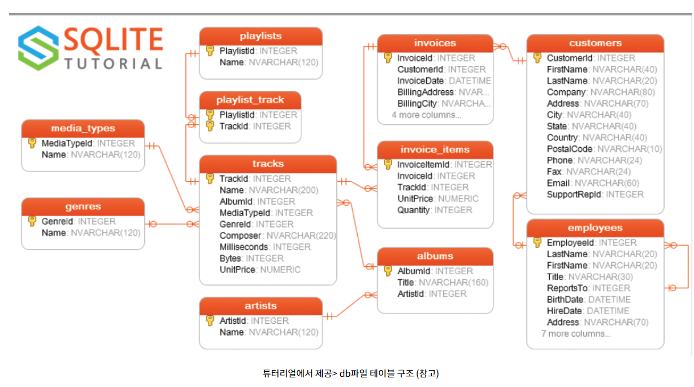
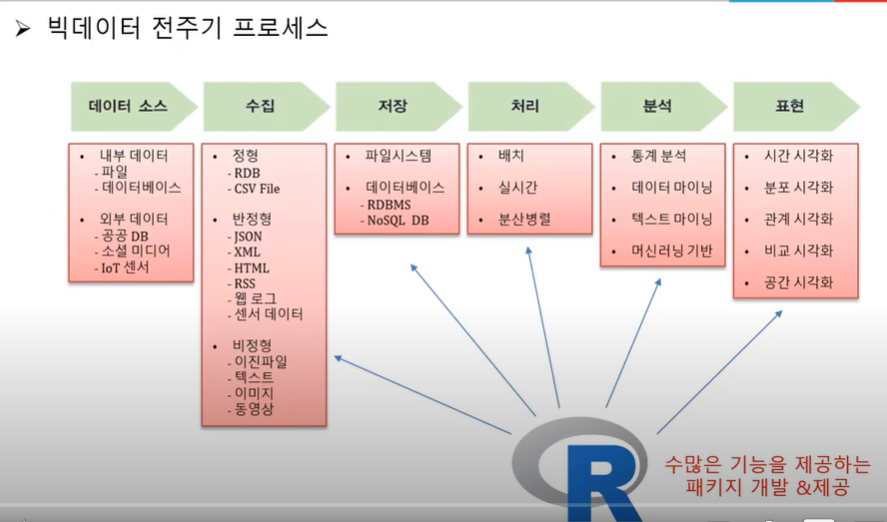

```{r setup, include=FALSE}
knitr::opts_chunk$set(echo=T, fig.align = "center", message=F, warning=F, fig.height = 8, cache=T, dpi = 300, dev = "png")

```


>

# SQL은 무엇인가?

---

SQL(Structured Query Language)은 관계 데이터베이스를 위한 표준 질의어   
> 데이터 베이스(DB)에 저장되어 있는 데이터를 다루는 언어


+ **데이터 정의어** : 테이블을 생성하고 변경·제거하는 기능을 제공한다.  
  
+ **데이터 조작어** : 테이블에 새 데이터를 삽입하거나, 테이블에 저장된 데이터를 수정·삭제·검색하는 기능을 제공한다.  
  
+ **데이터 제어어** : 보안을 위해 데이터에 대한 접근 및 사용 권한을 사용자별로 부여하거나 취소하는 기능을 하는 언어다. 데이터베이스 관리자가 주로 사용한다.  
  
[네이버 지식백과] SQL의 소개 (데이터베이스 개론, 2013. 6. 30., 김연희)


# DB는 무엇이고 왜 사용하는가? {.tabset .tabset-fade}  

---
1. 각각의 컴퓨터에 대용량이 있는것이아닌 하나의 서버에 대용량 데이터 저장  
2. 데이터 입력, 수정 필요할때  
3. 여러 연관 데이터를 연결해서 사용할때(정규화?)  
4. 데이터가 CSV와 같이 읽기 쉬운 형식이 아닐때(다양한 형태) 저장 가능.

```{r, echo=F,out.width="90%", fig.cap="테이블구조"}
library(knitr)


```


**데이터 저장에 용이**  
* 시스템 충돌 및 디스크 장애로부터 살아남을 수 있는 안정적인 스토리지  
* 메모리에 맞지 않는 데이터를 계산하도록 최적화  

**데이터 관리에 용이**  
* 데이터가 논리적으로 구성되는 방법과 액세스 권한을 가진 사용자를 설정  
* Can enforce guarantees on the data  
  + 데이터 이상 현상을 방지하는 데 사용할 수 있습니다.  
  + 데이터에 대한 안전한 동시 작동을 보장합니다.  

```{r, echo=F,out.width="90%", fig.cap="[유튜브캡쳐]https://www.youtube.com/watch?v=XvFEBlAZl0I&t=173s"}
library(knitr)




```

---

## 관계형 데이터베이스 관리 시스템(RDBMS)
 우왕 (상민님꺼 보고 따라했습니다!)
 
## NoSQL DBMS 

 No의 약자가 다 다르던데 Not only 로 해석해서 좀 더 포괄적인 개념인듯합니다.
 
## 인 메모리 데이터베이스 관리 시스템(IMDBMS)  

 속도가 가장 빠르다고 합니다.
 
## 기둥형 데이터베이스 관리 시스템(CDBMS)  

 신기

---


---

# DB와 R 연동시키기

---

 `dplyr`패키지에는 데이터베이스와 통신하기 위한 일반화된 SQL 백엔드가 있으며  
 `dbplyr`패키지는 R 코드를 데이터베이스별 변형(DBMS별로 다른듯)으로 변환 (dbplyr 사이트번역)   
SQL 변형은 Oracle, Microsoft SQL Server, PostgreSQL, Amazon Redshift, Apache Hive 및 Apache Impala와 같은 데이터베이스에서 지원됩니다. 
the generated SQL isn’t always as minimal as you might generate by hand.  
자동번역 기능이므로 가장 효율적인 쿼리를 작성하지는 않는다.  
==>더 효율적인 쿼리를 위해서는 SQL을 공부해야한다 

[SQLite 의 장점](https://www.itworld.co.kr/news/117213)  


SQLite:  
원래는 서버로 보내서 하는건데 이건 그냥 파일로 존재  
최대 140테라바이트라고 함  

[SQLite 설치](https://ansan-survivor.tistory.com/724?category=369695)  
[SQLite 튜토리얼](https://www.sqlitetutorial.net/sqlite-primary-key/)  
[연습용 DB사이트](https://baseballdb.lawlesst.net/chadwick)  

## SQlite 와 R 연동  

---

[출처](https://kkokkilkon.tistory.com/102?category=640116)  

[다양한 DBMS와 연결하는 방법 정리되어있는 사이트](https://db.rstudio.com/getting-started/)


```{r}
library(dplyr)
library(DBI)    # DB 관련 함수를 사용하기 위한 라이브러리
library(RSQLite)# SQLite 관련 함수를 사용하기 위한 라이브러리
# SQLite DB 구축/연결하기 
con <- dbConnect(SQLite(),
                 dbname = "C:/R/test.db") # test라는 db파일없으면 생성 있으면 연결
                   #"C:/R/test_db.sqlite")   확장자를 아예 sqlite로도 가능 

```

## 데이터 저장 

---

먼저 table을 생성해야 한다.  
DB에서는 컬럼명에 점( . )이 들어갈 수 없기 때문에 컬럼명을 변경한 iris_rename을 생성한다.  

```{r}

iris_rename <- janitor::clean_names(iris)
# sample_iris 테이블 생성하기
rs <- dbSendQuery(con, # 이걸 스키마라고하고 메타데이터라고도 한다.
                  "CREATE TABLE IF NOT EXISTS sample_iris 
                  (irisid INTEGER PRIMARY KEY AUTOINCREMENT, 
                  sepal_length NUMERIC,
                  sepal_width NUMERIC, 
                  petal_length NUMERIC,
                  petal_width NUMERIC,
                  species TEXT)")
dbClearResult(rs) # 쿼리문의 용량도 따로 제한(1MB)이 되어서 바로 clear
dbListTables(con)

```
여러 건의 데이터를 DB한번에 넣고 싶다면 아래와 같이 dbWriteTable 함수를 사용한다.
```{r}
# iris_rename 150건 데이터를 한번에 sample_iris 테이블에 넣기
dbWriteTable(con, "sample_iris", iris_rename, row.names = FALSE, append=TRUE)

# sample_iris 테이블에 잘 들어갔는지 확인
sample_iris <- dbGetQuery(con, "SELECT * FROM sample_iris")
dim(sample_iris) #150


flights <- copy_to(con, nycflights13::flights) # 직접 data.frame을 테이블로 생성시킬수 있다. 그런데 결과적으로 db파일에 저장되지는 않는다..?
dbListTables(con)


```


쿼리를 날릴 때 사용하는 함수는 크게 **2가지 종류**가 있다.
먼저 위에서 사용한 `dbSendQuery`는 DB에 쿼리를 보낼 때 사용한다. 
`dbClearResult` 함수를 이용하여 보낸 쿼리의 처리결과를 제거해주어야 한다. 테이블을 만들거나 데이터를 입력/수정/삭제하는 쿼리인 경우는 `dbSendQuery`를 사용하면 된다.


DB에 쿼리를 보내서 **데이터를 가져오는 것**은 `dbGetQuery` 함수만이 가능하다. 


## 데이터 조회  

---

```{r}

sample_virginica <- dbGetQuery(con, 
                                "SELECT * FROM sample_iris 
                                 WHERE species = 'virginica'")

head(sample_virginica)

tbl(con,"sample_iris") %>% 
  filter(petal_length>2) %>% 
  group_by(species) %>%
  summarize(m= mean(petal_length,na.rm=T)) %>% 
  show_query()

rs<-dbGetQuery(con,"SELECT `species`, AVG(`petal_length`) AS `m`
FROM `sample_iris`
WHERE (`petal_length` > 2.0)
GROUP BY `species`")
rs


```
이렇게 데이터가 들어가 있음을 확인할 수 있다.

## 데이터 수정  

---

```{r}
 rs <- dbSendQuery(con, "UPDATE sample_iris SET species = 'versicolor'
                         WHERE species = 'virginica'")
  dbClearResult(rs)
  
  # species가 virginica인 데이터가 없으면 성공
  sample_virginica <- dbGetQuery(con, 
                        # 보통 sql 은 ;을 꼭 붙인다고하는데 여긴 안붙음
                                 "SELECT * FROM sample_iris 
                                 WHERE species = 'virginica'")
  
  # sample_virginica의 행수 열수 출력
  dim(sample_virginica)
```

## 데이터 삭제 

---

### 테이블내 데이터 삭제

```{r}
# sample_iris 테이블 내 전체 데이터 삭제
  rs <- dbSendQuery(con, "DELETE FROM sample_iris")
  dbClearResult(rs)
  
# sample_iris를 가져와서 행수 열수 출력
  sample_iris <- dbGetQuery(con, "SELECT * FROM sample_iris")
  dim(sample_iris)
```
### 테이블 삭제

 내용이 모두 삭제되어 빈 껍데기만 있는 sample_iris 테이블을 삭제해보자.
 
```{r}
 
  # sample_iris 테이블 자체를 삭제 
rs <- dbSendQuery(con, "DROP TABLE sample_iris")
dbClearResult(rs)
  
dbListTables(con)

dbDisconnect(con)# 마지막엔 DB연결 끊기
```


# 더 공부하고 싶은 것

---
spark !? 데이터 처리하는 라이브러리(?)라고한다.


